# Predicting Galvanic Corrosion in Multi-Material Components

**A visual, runnable guide to locating corrosion near metal joints and making repeated simulations faster. Research from FAU × Schaeffler.**

<p align="center">
  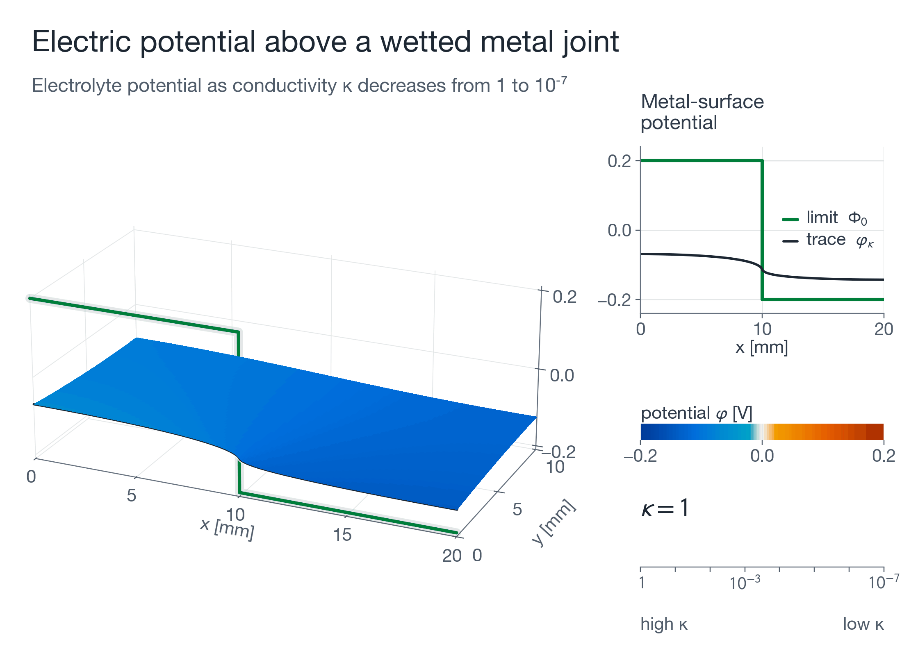
</p>

## From a wet joint to a corrosion assessment

A steel fastener in an aluminium housing, a bearing seat, or an exposed coating edge can bring different metals into electrical contact. When an electrolyte also connects their surfaces, galvanic current can drive dissolution of the anodic metal. For a component designer, the useful questions are practical:

* **Where is the attack concentrated?** Follow the current near the metal joint instead of relying only on an average over the surface.
* **Does the simulation resolve that region?** Put mesh resolution where the potential and current change most rapidly.
* **How can many design cases be assessed efficiently?** Use a cheaper approximation when its estimated errors meet the chosen tolerances.

The notebook [`corrosion_at_the_junction.ipynb`](corrosion_at_the_junction.ipynb) connects these questions to two research papers. A compact finite-element solver reproduces selected results and generates the figures and animations below. Its idealised, stationary corrosion benchmark explains current localisation and numerical accuracy; applying it to component life requires material data, exposure conditions and validation against experiments.

| | Paper | Code |
|:--|:--|:--|
| **[1]** | D. Fernández, *Singular limit phenomenon in a nonlinear elliptic model arising in electrochemistry*, [arXiv:2606.20619](https://arxiv.org/abs/2606.20619) | [singular-limit-corrosion](https://github.com/danielfdzm/singular-limit-corrosion) |
| **[2]** | D. Fernández, D. Penk, D. Riedelbauch, *Selective boundary condition reduction via learned error gating*, [arXiv:2609.08461](https://arxiv.org/abs/2609.08461) | [learning-boundary-condition](https://github.com/danielfdzm/learning-boundary-condition) |

---

## 1 · See how current flows across a metal joint

The model solves the electrical potential in the electrolyte and describes the reactions on each metal with a **Butler–Volmer law**. The dimensionless conductivity **κ** measures electrolyte conductance relative to surface reaction rates. Together with the material kinetics and geometry, it controls the current distribution.

The droplet animation illustrates the galvanic circuit: electrons travel through the connected metals, while ionic current crosses the electrolyte. In the figures, **orange marks the cathode** and **blue the anode**. Model-selection plots use **green for the limiting approximation** and **purple for the full nonlinear model**. Conductivity sweeps use saturated blue-to-purple tones and different line styles; comparison plots use distinct colors and markers. Potential fields use rich blue and orange with a narrow neutral band; numerical error runs from gold through magenta to deep purple. Dark current paths have white outlines to stay visible over the fields.

<p align="center">
  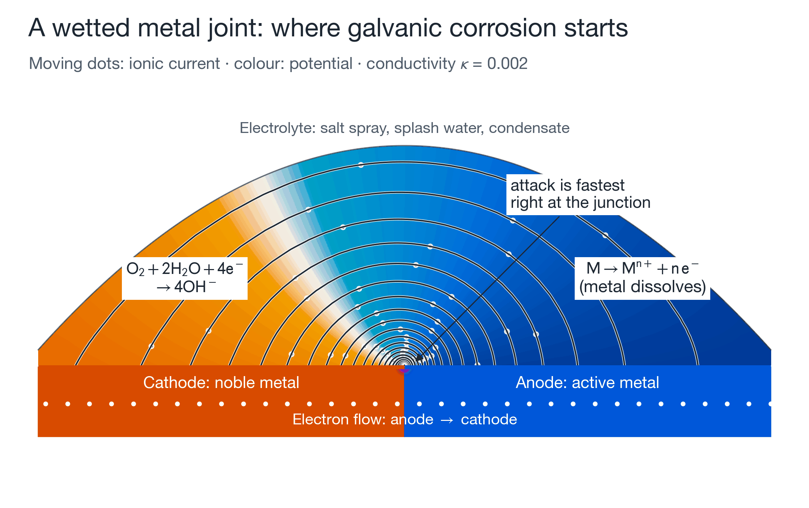
</p>

## 2 · Locate the region that needs a finer mesh [1]

For the metal pair studied here, decreasing κ concentrates the anodic current closer to the joint. The potential on the metal develops a sharp transition, so a simulation needs increasingly fine elements near that transition. This is the practical consequence of the **singular limit κ → 0** analysed in [1].

<p align="center">
  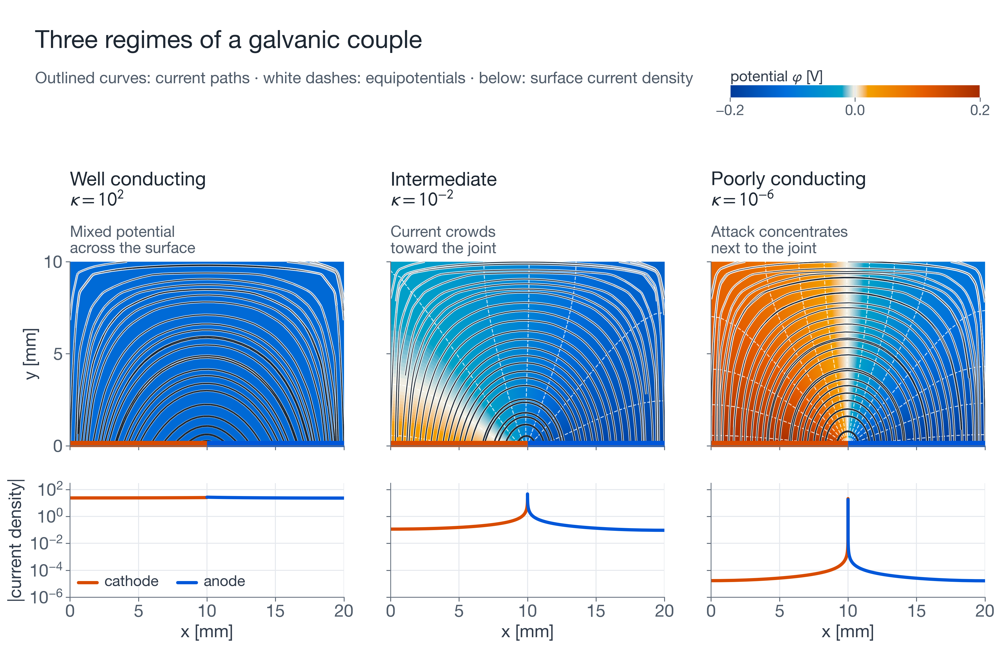
</p>

The comparison above moves from a nearly uniform surface potential at κ = 10² to a strongly localised response at κ = 10⁻⁶.

Use the reaction curves to see how conductivity changes the current at each metal surface.

<p align="center">
  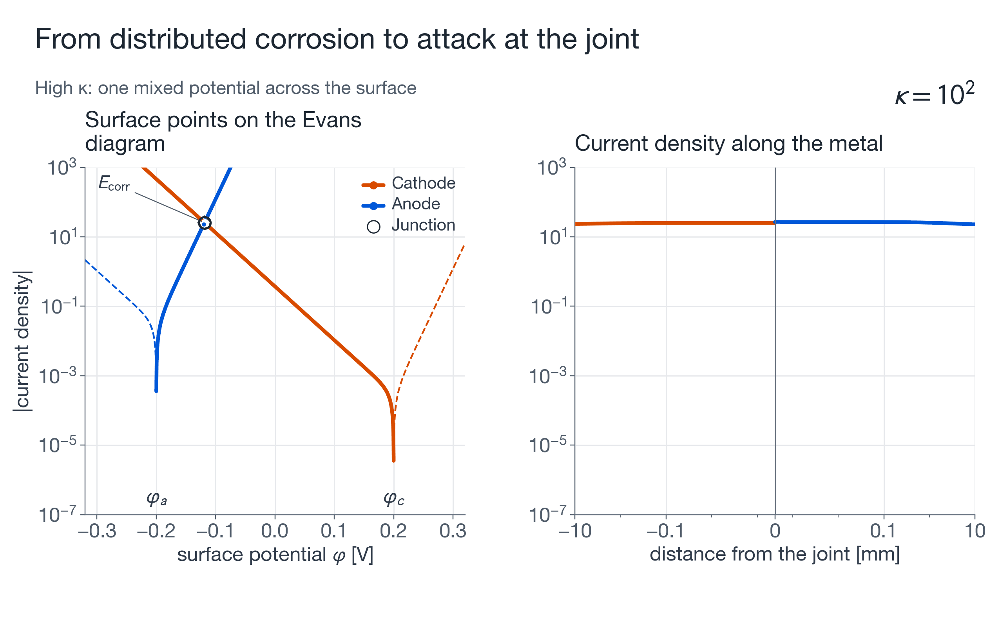
</p>

Zoom into the joint to see the narrow transition that the mesh needs to resolve.

<p align="center">
  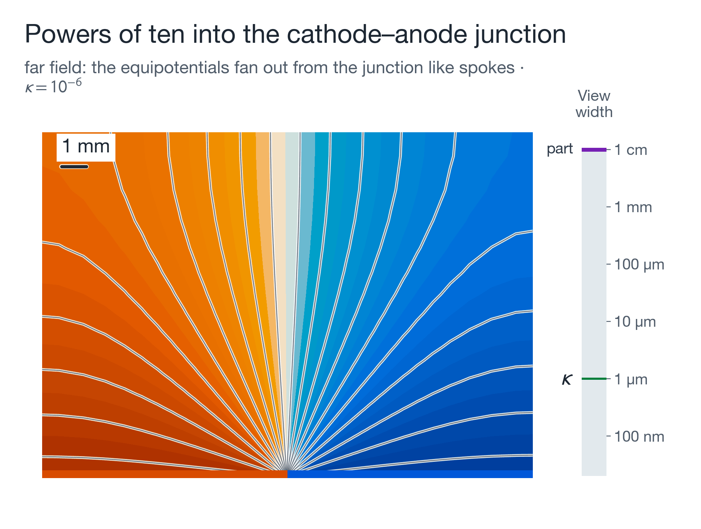
</p>

* **Localisation in the benchmark.** In the illustrated 20 mm × 10 mm electrolyte cross-section, half of the anodic current lies within **4.8 mm** of the joint at κ = 10², compared with **48 µm** at κ = 10⁻⁶. These distances depend on the model parameters and geometry.
* **A mesh rule for this regime.** Refine toward each joint with $h_{\min}\propto\kappa$. At κ = 10⁻⁵, the notebook's finest graded strategy gives about **0.5 % energy error**; the roughly 1,500-node uniform mesh exceeds **11,000 %**. This measures numerical energy error, rather than error in a predicted corrosion rate.
* **An accuracy check from the theory.** For N smooth cathode–anode junctions, the leading energy growth is $\frac{N(\varphi_c-\varphi_a)^2}{2\pi}\ln\frac1\kappa$ (Theorem 2.2). The notebook reproduces its slope to within **about 2 %** for N = 1–4, providing a check on whether the narrow junction region is resolved.

<p align="center">
  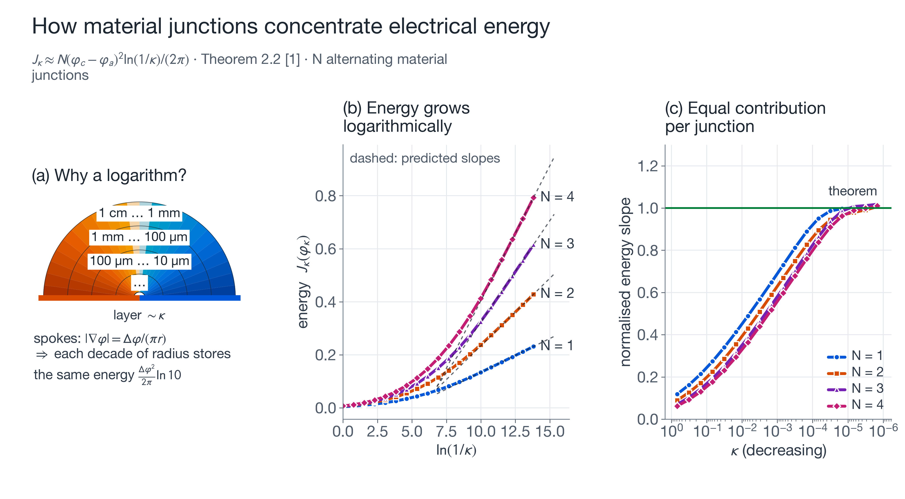
</p>

## 3 · Spend computation where the full model is needed [2]

Parameter sweeps and uncertainty studies require many model evaluations. In the small-κ regime, a **limiting approximation** replaces the nonlinear surface laws with prescribed potentials and uses a reusable linear solve.

A small neural network estimates the approximation's **potential errors in the electrolyte and on the metal surface**. The gate accepts the faster model only when both calibrated estimates meet the chosen tolerances; otherwise it runs the full nonlinear model. Predicting errors also lets the tolerance change without retraining.

<p align="center">
  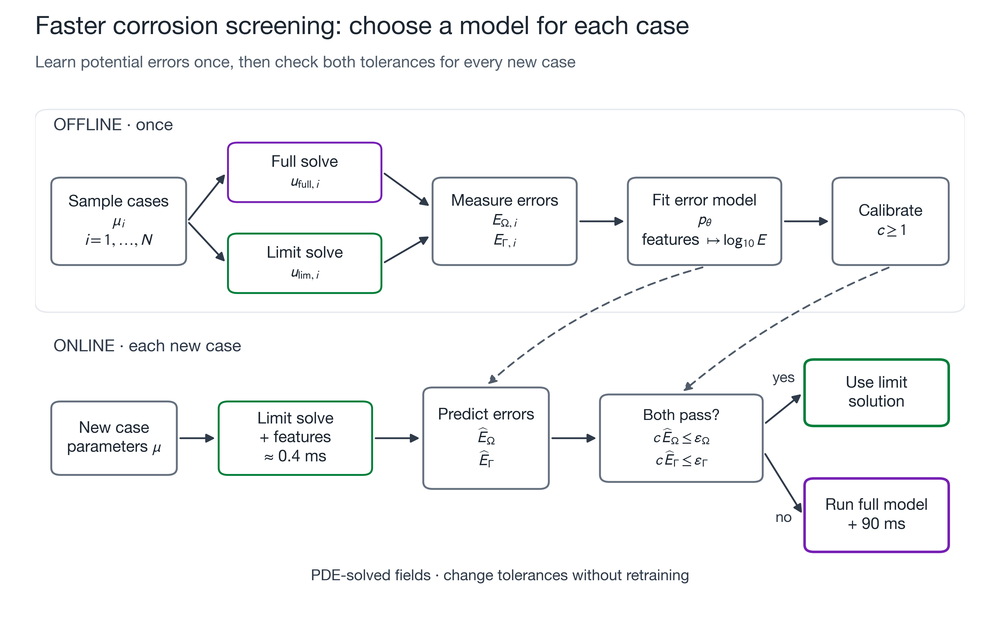
</p>

**Corrosion benchmark, reproduced in the notebook.** The experiment follows [2]'s seeds, mesh, features and estimator. The spot check agrees with the archived errors to seven digits. At **5 % tolerances**, the first locked evaluation contains **320 test cases**: the calibrated gate accepts the approximation in **111 cases**, with **0 accepted cases exceeding either measured tolerance**. This is a result on that test set; the tolerances refer to potential errors, not directly to current density or component life.

The cached paired-solve measurements record about **0.4 ms for the limiting solve and features** and **90 ms for the full solve**, with prediction overhead added by the gate. The benefit across a complete study depends on how many cases qualify and how often a full solve is still needed. Timings depend on hardware.

Follow each case through the model selection and compare the accumulated computation time.

<p align="center">
  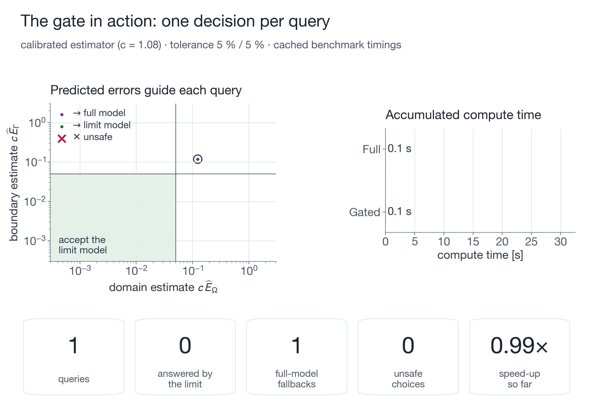
</p>

Adjust the potential-error tolerance to see how it changes model acceptance and computation time.

<p align="center">
  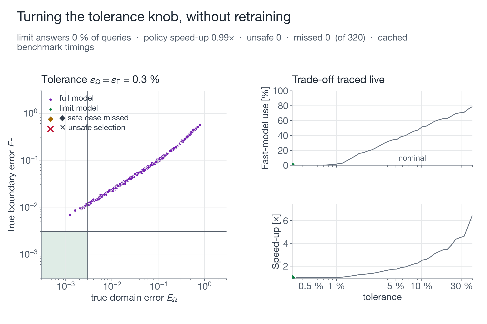
</p>

<p align="center">
  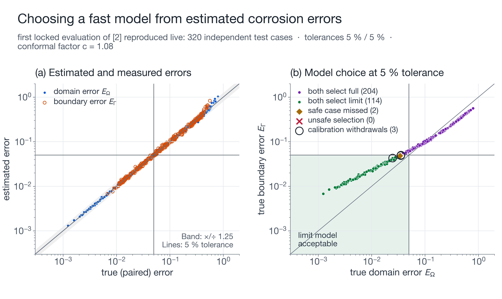
</p>

**Archived speed-ups from separate benchmarks in [2].** The paper also tests the selection method on nonlinear transfer problems. Its stationary benchmark reports **133× faster accepted queries** and **8.3× faster execution of the complete 64-query workload**, including full-model fallbacks. These are archived results from that benchmark, separate from the corrosion benchmark timings above.

## Results at a glance

<p align="center">
  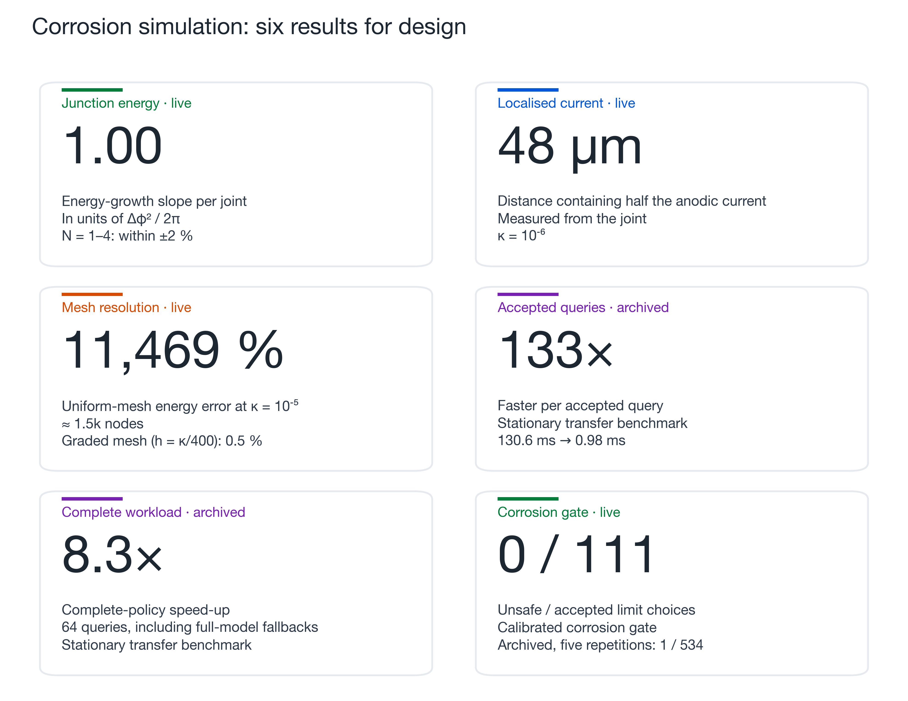
</p>

---

## Use the results in context

The notebook supports understanding current localisation, checking mesh resolution and testing when a faster potential model meets an error tolerance. It assumes a fixed metal partition and an activation-controlled, stationary electrolyte model. Concentration effects and an evolving corrosion surface are outside this model.

The interactive `playground(...)` cell lets you vary conductivity, equilibrium potentials, exchange currents and tolerance, then compare the gate's estimate with a full solve. Use this comparison to explore the accuracy–cost trade-off; new materials, exposures or geometries require validation with representative cases.

## Run it

```bash
python -m pip install numpy scipy matplotlib scikit-learn pillow jupyterlab
jupyter lab corrosion_at_the_junction.ipynb      # then: Run ▸ Run All Cells
```

The setup cell controls the exports:

```python
FAST = False                # True: smaller numerical studies and fewer animation frames
RENDER_ANIMATIONS = True     # False: display a still frame for each animation
TEXT_SCALE = 1.6             # enlarge all labels and annotations
MIN_TEXT_SIZE = 14           # minimum text size, in points
FIGURE_DPI = 300             # resolution of PNG figures
ANIMATION_DPI = 220          # resolution of GIF frames
```

The default exports use **white backgrounds, saturated colors, and larger text**, with PNG figures roughly **3,100–4,100 pixels wide** and GIFs roughly **2,000–2,600 pixels wide**. Figures and GIFs are written to [`assets/`](assets/), and the paired dataset of Part III is cached in `.cache/`. Numerical solve time and animation rendering time depend on the selected settings and hardware. Use `FAST = True` for a lower-cost preview, or `RENDER_ANIMATIONS = False` to inspect still frames without rendering GIFs.

| Folder content | |
|:--|:--|
| `corrosion_at_the_junction.ipynb` | the guided tour (Parts I–IV, executed, with outputs) |
| `assets/` | every figure (PNG) and animation (GIF) produced by the notebook |
| `README.md` | project overview (this page) |

## Citation

```bibtex
@article{fernandez2026singular,
  title   = {Singular limit phenomenon in a nonlinear elliptic model arising in electrochemistry},
  author  = {Fern{\'a}ndez, Daniel},
  journal = {arXiv preprint arXiv:2606.20619},
  year    = {2026}
}
@article{fernandez2026gating,
  title   = {Selective boundary condition reduction via learned error gating},
  author  = {Fern{\'a}ndez, Daniel and Penk, Dominik and Riedelbauch, Dominik},
  journal = {arXiv preprint arXiv:2609.08461},
  year    = {2026}
}
```

*Research by FAU Erlangen-Nürnberg (Chair for Dynamics, Control, Machine Learning and Numerics, Alexander von Humboldt Professorship) and Schaeffler Technologies AG & Co. KG. Both works were funded by Schaeffler Technologies AG & Co. KG.*
